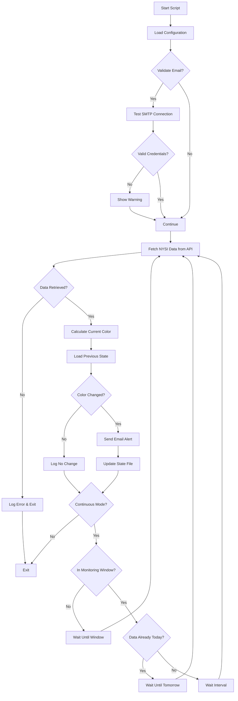

# Crap Stock Monitor

## Summary

A Python script that monitors the NYSE McClellan Summation Index (NYSI) and sends email alerts when the trend changes from "Red" (declining) to "Black" (rising) or vice versa. Uses direct API calls to StockCharts for reliable data access.

## Installation

```bash
pip install requests
python crap_stock_monitor.py --check  # Test run
```

## Requirements

**Environment:**
- Python 3.6+
- Internet connection

**Libraries:**
- `requests` (for API calls)
- Built-in: `smtplib`, `email`, `json`, `datetime`, `argparse`

**Configuration:**
- Requires `email_details.py` for email notifications
- Creates `NYSI_state.json` to track state between runs

## Details

### Logic Flow



## Usage

```bash
# Single check and exit
python crap_stock_monitor.py --check

# Continuous monitoring with custom interval and window
python crap_stock_monitor.py --interval 60 --window 09:30-16:00

# Validate email credentials only
python crap_stock_monitor.py --validate-email
```

## Configuration

Create `email_details.py`:

```python
sender_email = "your.email@gmail.com"
sender_password_password = "your-app-password"  # Gmail app password  
recipients = ["recipient@example.com"]
```