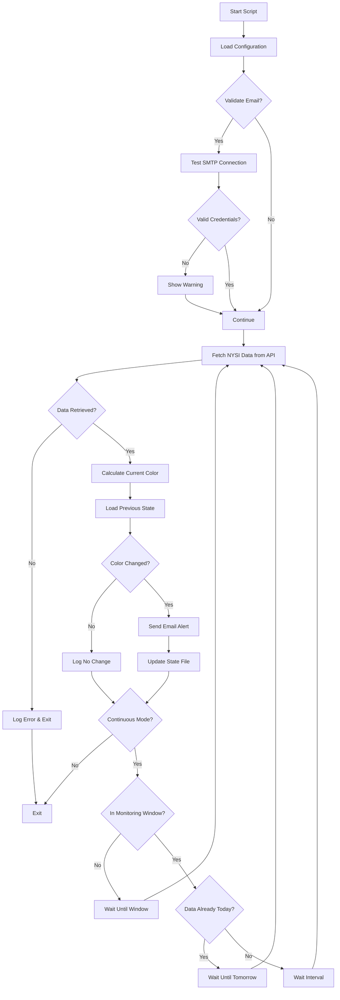

# Crap Stock Tools

This repository contains two main Python tools for stock market analysis:

- **[Crap Stock Monitor](#crap-stock-monitor)**: Monitors the NYSE McClellan Summation Index (NYSI) and sends email alerts when trend changes occur
- **[Trading Simulator](#trading-simulator)**: Generates trading simulation reports by combining NYSI data with stock price data to analyze trading strategies

---

## Crap Stock Monitor

A Python script that monitors the NYSE McClellan Summation Index (NYSI) and sends email alerts when the trend changes from "Red" (declining) to "Black" (rising) or vice versa. Uses direct API calls to StockCharts for reliable data access.

### Installation

```bash
pip install -r requirements-monitor.txt
python crap_stock_monitor.py --check  # Test run
```

### Requirements

**Environment:**

- Python 3.6+
- Internet connection

**Libraries:**

- `requests` (for API calls)
- Built-in: `smtplib`, `email`, `json`, `datetime`, `argparse`

**Configuration:**

- Requires `email_details.py` for email notifications
- Creates `NYSI_state.json` to track state between runs

### Usage

```bash
# Single check and exit
python crap_stock_monitor.py --check

# Continuous monitoring with custom interval and window
python crap_stock_monitor.py --interval 60 --window 09:30-16:00

# Validate email credentials only
python crap_stock_monitor.py --validate-email
```

### Configuration

Create `email_details.py`:

```python
sender_email = "your.email@gmail.com"
sender_password_password = "your-app-password"  # Gmail app password  
recipients = ["recipient@example.com"]
```

<details>
<summary>Logic Flow Diagram</summary>



</details>

---

## Trading Simulator

A Python script that fetches NYSI data from StockCharts and stock data from Yahoo Finance, merges the data by date, and generates trading simulation reports. The tool analyzes how trading strategies based on NYSI signals would perform with specific stocks.

### Setup

```bash
pip install -r requirements-simulator.txt
```

### System Requirements

**Environment:**

- Python 3.6+
- Internet connection

**Libraries:**

- `requests` (for StockCharts API)
- `pandas` (for data manipulation)
- `yfinance` (for stock data)
- Built-in: `datetime`, `argparse`

### Running Simulations

```bash
# Basic simulation with defaults (NYSI + GGUS.AX, 12 months)
python trading_simulator.py

# Custom stock and indicator with specific timeframe
python trading_simulator.py -i $NYSI -s GGUS.AX -m 12 -p Close

# Generate CSV output instead of HTML
python trading_simulator.py --csv -o data.csv -m 24

# Exclude trading during volatile periods
python trading_simulator.py -m 12 --blacklist-start 2024-12-20 --blacklist-end 2025-01-10
```

### Options

- `-i, --indicator`: Indicator ticker (default: $NYSI)
- `-s, --stock`: Stock ticker (default: GGUS.AX)
- `-b, --buy-signal`: Buy signal color (default: Black)
- `-m, --months`: Duration in months (default: 12)
- `-p, --price-type`: Stock price type (default: Close)
- `-o, --output`: Custom output filename
- `--csv`: Output as CSV instead of HTML
- `--blacklist-start/end`: Exclude trading during specified date range

### Output

The script generates either:

- **HTML**: Interactive webpage with trading simulation results (default)
- **CSV**: Data file for further analysis (with `--csv` flag)

Files are automatically named as: `INDICATOR_STOCK_MONTHS_trading_sim_YYYYMMDD_HHMMSS.html/csv`
